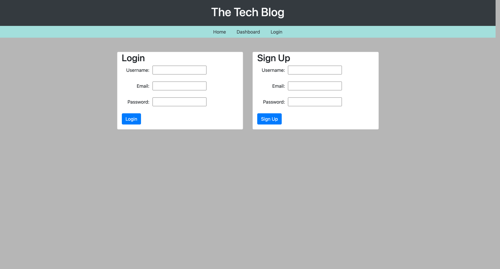
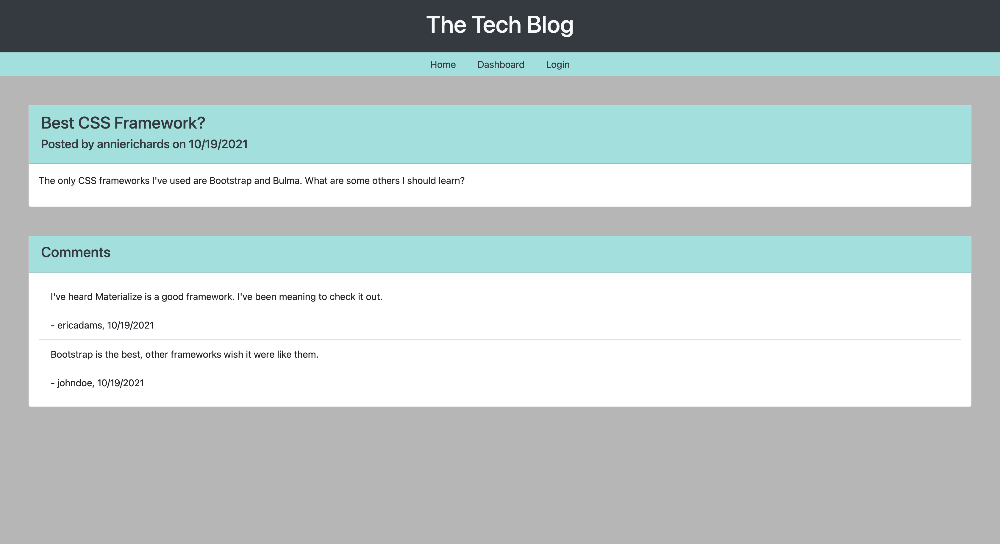
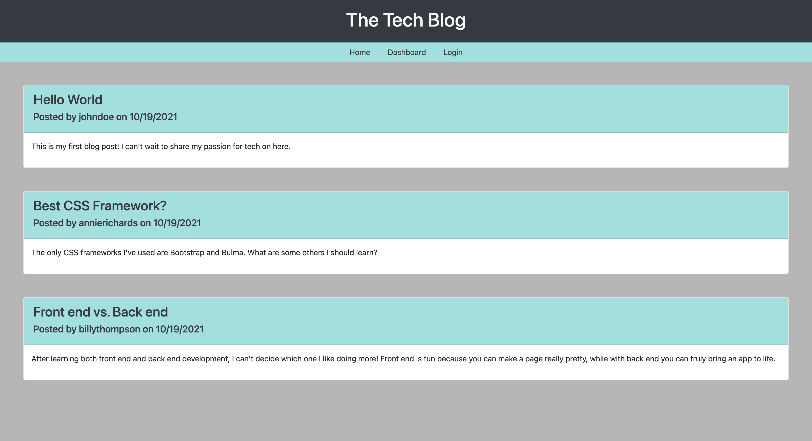

# tech-blog

## Description

This is a full-stack CMS-style blog application, similar to sites like WordPress. Users can sign up and/or log in to their own accounts to access others' posts as well as create their own.







## Table of Contents

- [Installation](#installation)
- [Tests](#tests)
- [Usage](#usage)
- [Credits](#credits)
- [License](#license)
- [Links](#links)
- [Questions](#questions)

## Installation

Use the following command to install dependencies:

```
$ npm i
```

Initialize the schema.sql in a MySQL shell, then seed in the provided data in the regular command line with the following commands:

```
mysql> SOURCE db/schema.sql;
```

```
$ node seeds/index.js
```

The following command initializes the app:

```
$ node server.js
```

## Tests

Use the following command for tests:

```
$ npm run test
```

## Usage

When used in the browser, a user can sign up and/or log in to access already existing blog posts, as well as create, update, or delete their own posts. Users can also see comments on posts and share their own.

## Credits

N/A

## License

This project is licensed under the MIT license.

## Links

This application is deployed to Heroku and can be viewed [here](https://fast-chamber-00133.herokuapp.com/).

## Questions

If you have any questions about this repository, open an issue or contact me directly at liaobrien123@gmail.com. You can find more of my work at [liaobrien](https://github.com/liaobrien).
